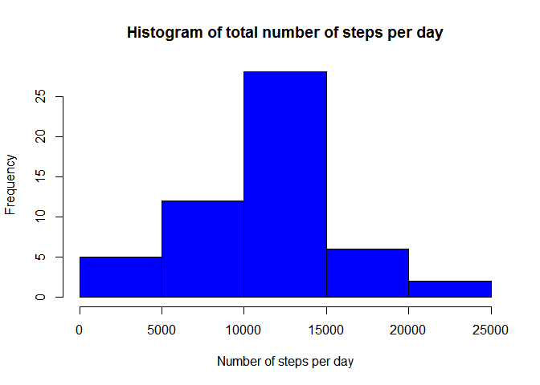
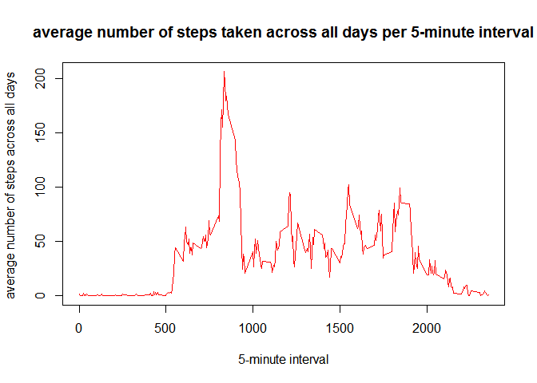
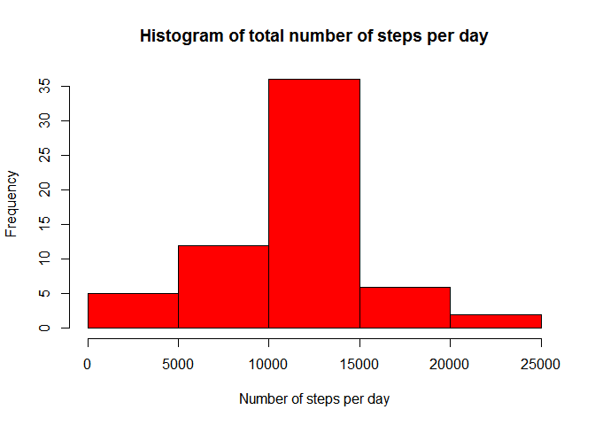

### Assignment: Course Project 1

## Loading and preprocessing the data

```r
rm(list=ls())
library (lattice)
library(zoo)
```

```
## 
## Attaching package: 'zoo'
```

```
## The following objects are masked from 'package:base':
## 
##     as.Date, as.Date.numeric
```

```r
file.url<-'https://d396qusza40orc.cloudfront.net/repdata%2Fdata%2Factivity.zip'
download.file(file.url,destfile='activity.data.zip')
activity.datafile <- unzip('activity.data.zip',overwrite=TRUE)
activity.data <- read.csv(activity.datafile, sep=",")
head(activity.data,n=5)
```

```
##   steps       date interval
## 1    NA 2012-10-01        0
## 2    NA 2012-10-01        5
## 3    NA 2012-10-01       10
## 4    NA 2012-10-01       15
## 5    NA 2012-10-01       20
```

The dataset includes three variable
1. steps: Number of steps taking in a 5-minute interval (missing values are coded as NA)
2. Date: The date on which the measurement was taken in YYYY-MM-DD format
3. interval: Identifier for the 5-minute interval in which measurement was taken?

## What is mean total number of steps taken per day?


```r
# Calculate the total number of steps taken per day
totalnumberofstepperday <- tapply(activity.data$steps,(activity.data$date),sum)
# Histogram of the total number of steps per day
hist(totalnumberofstepperday,main = paste("Histogram of total number of steps per day"),xlab="Number of steps per day", col='blue')
```



```r
# Calculate the mean and median of the total number of steps taken per day
totalnumberofstepperday.mean <- mean(totalnumberofstepperday, na.rm=TRUE)
totalnumberofstepperday.median <- median(totalnumberofstepperday, na.rm=TRUE)
```

## The mean of the total number of steps taken per day is:


```
## [1] 10766.19
```

## The median of the total number of steps taken per day is :

```
## [1] 10765
```


## What is the average daily activity pattern?

```r
library(zoo)
average <- tapply(activity.data$steps,activity.data$interval,mean,na.rm = TRUE)
interval <- activity.data$interval
interval.average <- zoo(average,interval)
```

```
## Warning in zoo(average, interval): some methods for "zoo" objects do not
## work if the index entries in 'order.by' are not unique
```

```r
plot(interval.average,type='l', xlab="5-minute interval", ylab="average number of steps across all days ", main = "average number of steps taken across all days per 5-minute interval", col='red')
```




## The 5-minute interval that contains the maximum number of steps (on average across all the days in the dataset ) is:

```r
names(which.max(interval.average))
```

```
## [1] "835"
```

## Imputing missing values


```r
# Calculate and report the total number of missing values in the dataset (i.e. the total number of rows with NAs)
totalnumberofNA <- sum(is.na(activity.data$steps))
```
## The total number of missing values in the dataset (i.e. the total number of rows with NAs) is :


```
## [1] 2304
```

Devise a strategy for filling in all of the missing values in the dataset
Here, I am replacing the missing values with the mean for the corresponding 5-minute interval


```r
#Create a new dataset that is equal to the original dataset but with the missing data filled in.
modified.activity.data <- activity.data # a new dataset that is equal to activity.data but the missing data will be filled in
colnames <- names(average)
for (i in 1:nrow(modified.activity.data) )
{
  if (is.na(modified.activity.data$steps[i]))
  {modified.activity.data$steps[i] = average[[colnames=as.character(modified.activity.data$interval[i])]]}
}

# Calculate the total number of steps taken per day for the modified dataset
modified.totalnumberofstepperday <- tapply(modified.activity.data$steps,(modified.activity.data$date),sum)
# Histogram of the total number of steps per day
hist(modified.totalnumberofstepperday,main = paste("Histogram of total number of steps per day"),xlab="Number of steps per day",col='red')
```



```r
# Calculate the mean and median of the total number of steps taken per day
modified.totalnumberofstepperday.mean <- mean(modified.totalnumberofstepperday,na.rm = TRUE)
modified.totalnumberofstepperday.median <- median(modified.totalnumberofstepperday,na.rm = TRUE)
```
Do these values differ from the estimates from the first part of the assignment? What is the impact of imputing missing data on the estimates of the total daily number of steps?

## The difference in mean after replacing the missing data is :

```r
modified.totalnumberofstepperday.mean- totalnumberofstepperday.mean
```

```
## [1] 0
```

## The difference in median after replacing the missing data is 

```r
modified.totalnumberofstepperday.median- totalnumberofstepperday.median
```

```
## [1] 1.188679
```


## Are there differences in activity patterns between weekdays and weekends?

```r
# Create a new factor variable in the dataset with two levels - "weekday" and "weekend" indicating whether a given date is a weekday or weekend day.
daytype <- weekdays(as.Date(modified.activity.data$date))
 for (i in 1:nrow(modified.activity.data))
 {
 if (daytype[i]=="Saturday" | daytype[i]=="Sunday") 
   {daytype[i]="weekend"}
   else {daytype[i] = "weekday"}
 }
modified.activity.data$daytype=factor(daytype)

# Are there differences in activity patterns between weekdays and weekends?
stepsperday <- aggregate(steps ~ interval + daytype, data = modified.activity.data, mean)
names(stepsperday) <- c("interval", "daytype", "steps")
xyplot(steps ~ interval | daytype, stepsperday, type = "l", layout = c(1, 2), xlab = "Interval", ylab = "Number of steps")
```


## The above plot shows that during the weekdays, there is a peack in the activities at interval ~ 900, while during the weekend the activities don't change much during the day 
